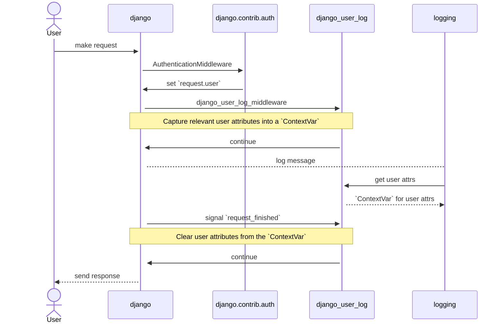

<div align="center">

# `django-user-log`

A Python [logging][python:logging] filter for [Django][django] user attributes

[][ci:release]
[][codecov]
[][python]
[][pypi]

</div>

`django-user-log` provides a Python [logging][python:logging] filter that
injects attributes from the currently logged in [Django][django] user.

It uses a [`ContextVar`][python:contextvars] to store user attributes for use on
the current thread. These are then injected into all log records via a logging
filter.

_[Visit the documentation][docs]._



#### Resources

* [Django &mdash; How to configure and use logging][django:logging]

#### Related Projects

* [madzak/python-json-logger][python-json-logger]
* [snok/django-guid][django-guid]

## Installation

Install via `pip`:

```shell
pip install django-user-log
```

Or, via [`poetry`][poetry]:

```shell
poetry add django-user-log
```

## Contributing

Thank you for considering contributing to `django-user-log`! Please see the
[Contribution Guidelines][contributing].

## Security Vulnerabilities

Please review the [Security Policy][security] on how to report security
vulnerabilities.

## Licence

`django-user-log` is open-sourced software licenced under the
[MIT licence][licence].

[ci:release]: https://github.com/axieum/django-user-log/actions/workflows/release.yml
[ci:test]: https://github.com/axieum/django-user-log/actions/workflows/test.yml
[codecov]: https://app.codecov.io/gh/axieum/django-user-log
[contributing]: CONTRIBUTING.md
[django]: https://djangoproject.com/
[django:logging]: https://docs.djangoproject.com/en/stable/howto/logging/
[django-guid]: https://github.com/snok/django-guid
[docs]: https://axieum.github.io/django-user-log
[licence]: https://opensource.org/licenses/MIT
[poetry]: https://python-poetry.org/
[pypi]: https://pypi.org/project/django-user-log
[python]: https://python.org/
[python:contextvars]: https://docs.python.org/3/library/contextvars.html
[python:logging]: https://docs.python.org/3/library/logging.html
[python-json-logger]: https://github.com/madzak/python-json-logger
[security]: SECURITY.md
